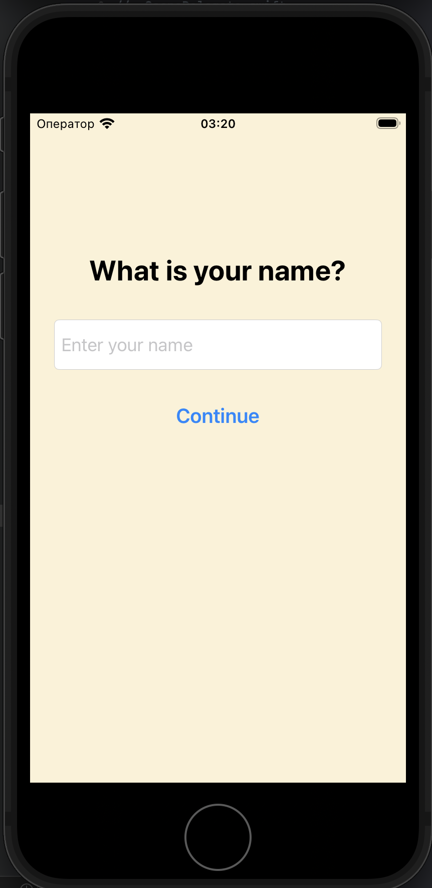
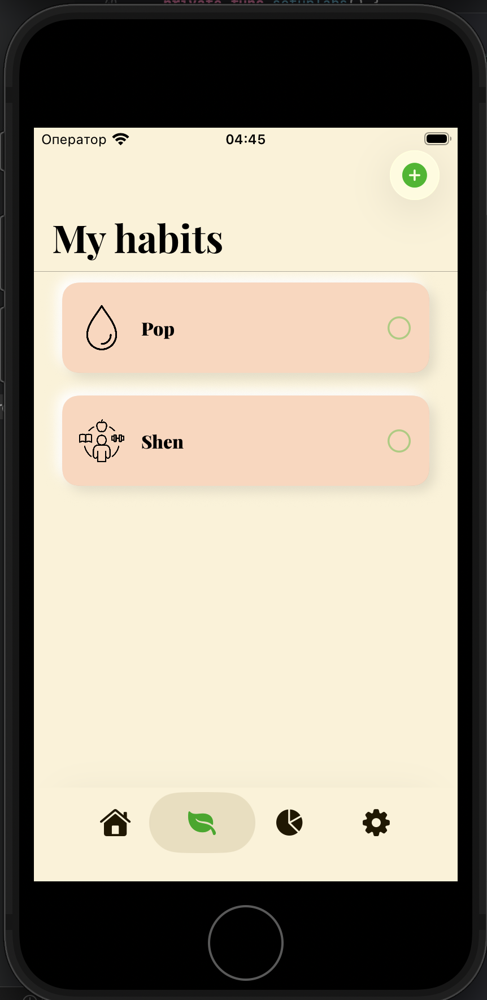
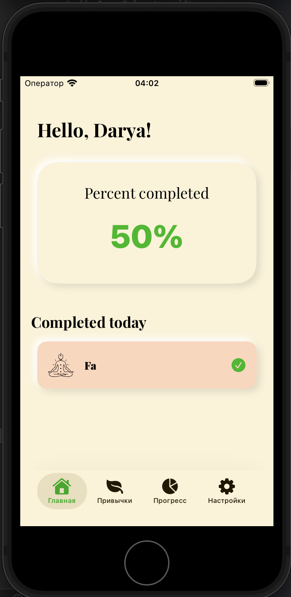
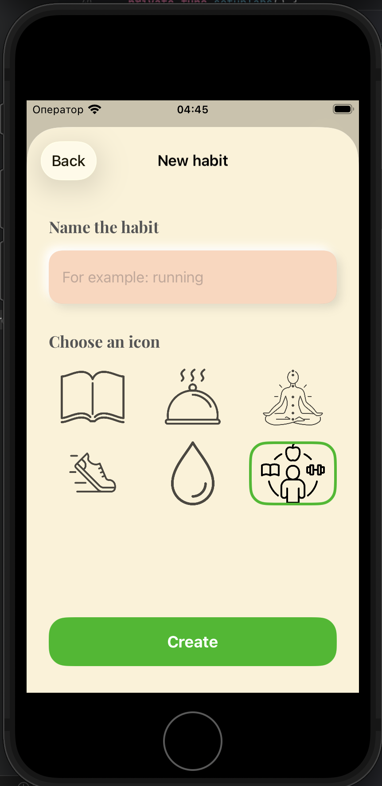
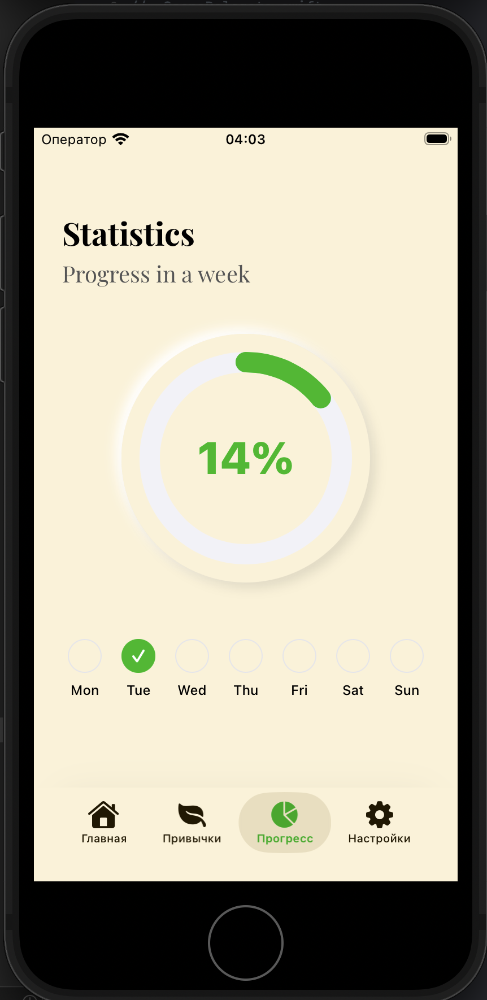
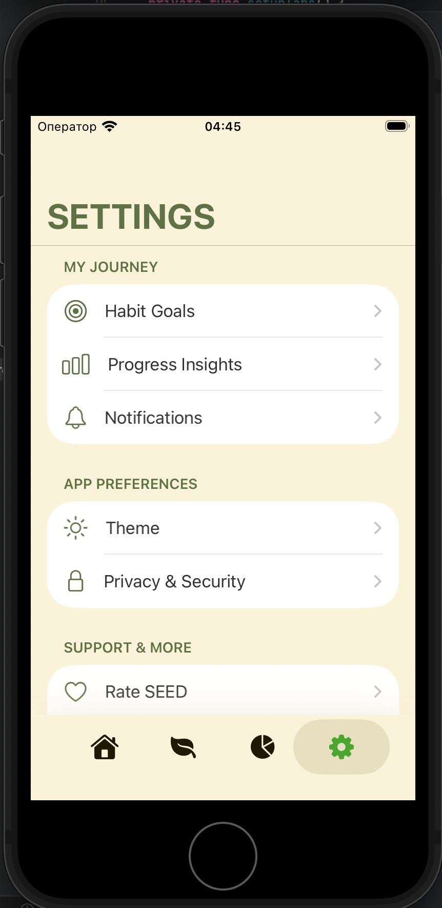

# Seed – Habit Tracker App

iOS приложение для отслеживания привычек и прогресса с минималистичным дизайном и аналитикой

---

## Features

- Создание привычек
- Статистика выполнения задач
- Настройки уведомлений
- Отслеживание дней захода в приложение

---

## Tech Stack

- Swift
- UIKit
- CoreData
- Модифицированный VIPER
- UserDefaults

---

## Screenshots

## 📸 Screenshots

  
  
  

  
  
  

---

## Architecture

Приложение построено с разделением ответственности:

- ViewController — UI
- Interactor — бизнес-логика
- Presenter — работа перед отображением
- Repository — хранение (CoreData)
- Model
- Protocols 
